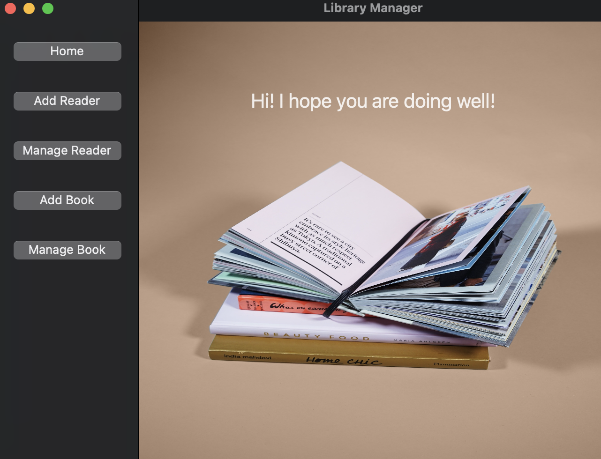
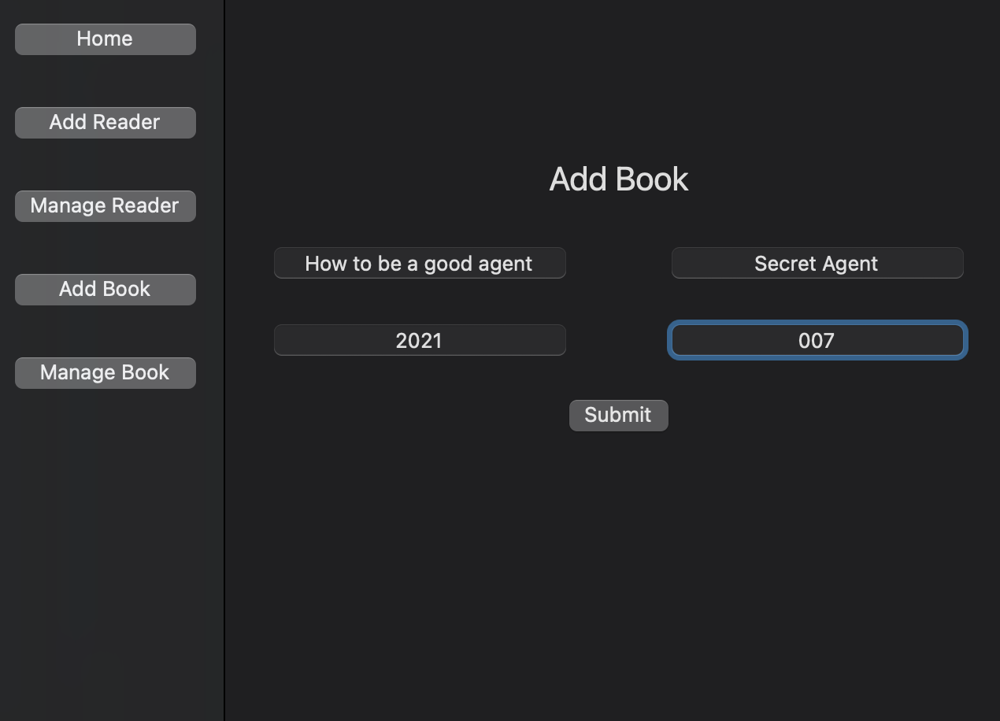
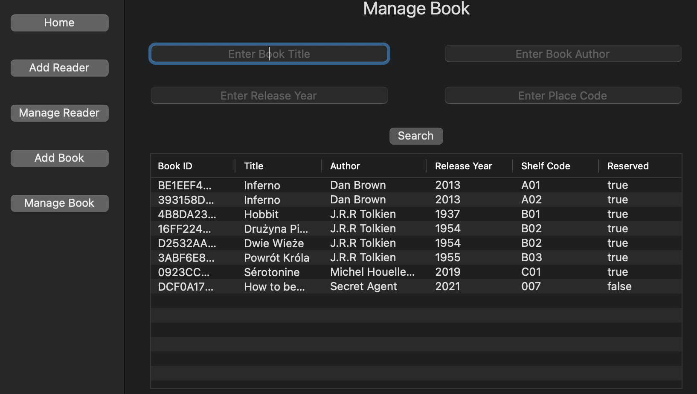
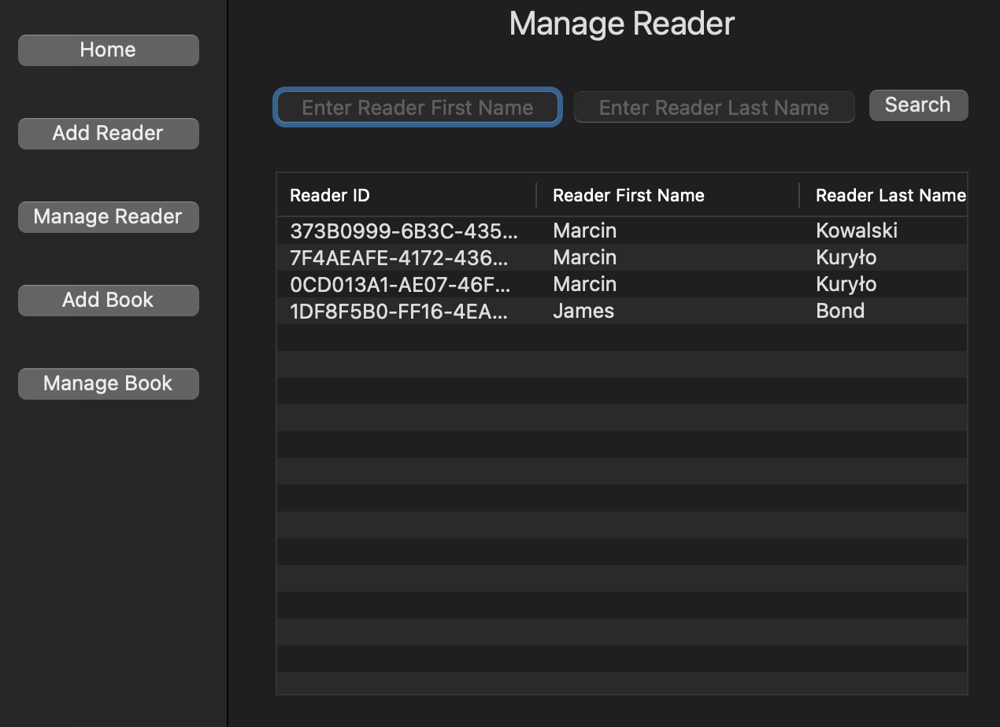
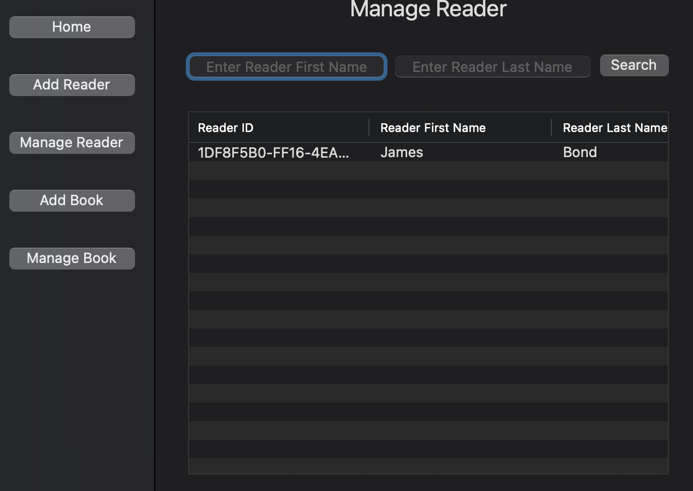
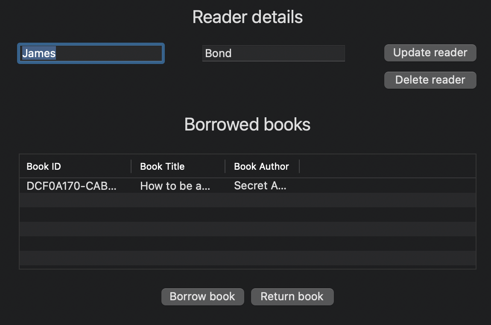
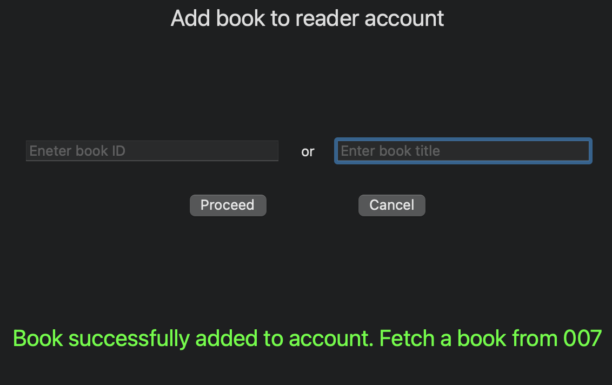

# LibraryManager

MacOS app designed to help with library management.
Local data persistance provided with realm database.

# Functionalities

* Create Reader and Book
* Read Reader and Book (search by one ore more key)
* Update Reader and Book
* Delete Reader and Book

## Create

  

## Read

   

To displayt more detailed information - click on a cell

## Update

You can easily edit user or book info in detailed view.
User can also add a book to reader account (maximum amount of borrowed books == 5)

## Delete

Reader may be deleted from db if the reader doesn't have any borrowed books assigned to accout.
Book can be dropped if isn't owned by any user.
